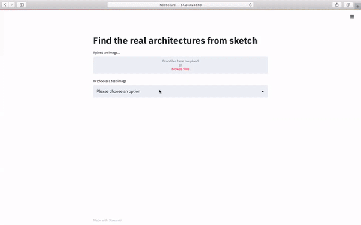

# Architecture Finder

[![MIT License][license-shield]][license-url]
[![LinkedIn][linkedin-shield]][linkedin-url]


<!-- PROJECT LOGO -->
<br />
<p align="center">
  <a href="http://archifinder.xyz">
    
  </a>

  <h3 align="center">ArchiFinder</h3>

  <p align="center">
    Find real architectures from architectural sketches
    <br />
    <a href="http://archifinder.xyz"><strong>Explore the web application »</strong></a>
    <br />
    <br />
    <a href="https://docs.google.com/presentation/d/10OSLoMiNkEE_pJMZ9jVsP5x5NecPogWURJb30S_J2eY/edit?usp=sharing">View Video Demo</a>
    ·
    <a href="https://docs.google.com/presentation/d/10OSLoMiNkEE_pJMZ9jVsP5x5NecPogWURJb30S_J2eY/edit?usp=sharing">View Google slides</a>
    ·
    <a href="https://github.com/zhangchi9/ArchitectureFinder/issues">Report Bug</a>
    ·
    <a href="https://github.com/zhangchi9/ArchitectureFinder/issues">Request Feature</a>
  </p>
</p>


<!-- TABLE OF CONTENTS -->
## Table of Contents

* [About the Project](#about-the-project)
  * [Built With](#built-with)
* [Installation](#Installation)
* [Usage](#usage)
* [Roadmap](#Roadmap)
* [License](#license)
* [Contact](#contact)


<!-- ABOUT THE PROJECT -->
## About The Project
<p align="center">

</p>

ArchiFinder is a web application aim at helping architects find information quickly and reliably. In the standard architecture design process, information collection is a very important step. Architects want to find other people's work for reference, ideation, brainstorm. So that many websites have been created to help people find buildings using keywords. However, the building's style, shape, and structure are hard to describe by keywords. 

ArchiFinder allows users to upload a sketch and will find similar buildings through visual style similarity searching.

### Built With
* [Anaconda](https://www.anaconda.com/)
* [Streamlit](https://www.streamlit.io/)


<!-- Installation -->
## Installation

This is an example of how you may give instructions on setting up your project locally.
To get a local copy up and running follow these simple example steps.
```sh
git clone https://github.com/zhangchi9/ArchitectureFinder
cd ArchitectureFinder
pip install requirements.txt
```

<!-- USAGE EXAMPLES -->
## Usage
```sh
cd ArchitectureFinder/webapp
streamlit run app.py
```

<!-- ROADMAP -->
## Roadmap

See the [open issues](https://github.com/zhangchi9/ArchitectureFinder/issues) for a list of proposed features (and known issues).


<!-- CONTRIBUTING -->
## Contributing

Contributions are what make the open source community such an amazing place to be learn, inspire, and create. Any contributions you make are **greatly appreciated**.

1. Fork the Project
2. Create your Feature Branch (`git checkout -b feature/AmazingFeature`)
3. Commit your Changes (`git commit -m 'Add some AmazingFeature'`)
4. Push to the Branch (`git push origin feature/AmazingFeature`)
5. Open a Pull Request


<!-- LICENSE -->
## License

Distributed under the MIT License. See `LICENSE` for more information.


<!-- CONTACT -->
## Contact

Chi Zhang - [http://zhangchi9.github.io/](http://zhangchi9.github.io/)

Project Link: [https://github.com/zhangchi9/ArchitectureFinder](https://github.com/zhangchi9/ArchitectureFinder)


<!-- MARKDOWN LINKS & IMAGES -->
<!-- https://www.markdownguide.org/basic-syntax/#reference-style-links -->
[contributors-shield]: https://img.shields.io/github/contributors/othneildrew/Best-README-Template.svg?style=flat-square
[contributors-url]: https://github.com/othneildrew/Best-README-Template/graphs/contributors
[forks-shield]: https://img.shields.io/github/forks/othneildrew/Best-README-Template.svg?style=flat-square
[forks-url]: https://github.com/othneildrew/Best-README-Template/network/members
[stars-shield]: https://img.shields.io/github/stars/othneildrew/Best-README-Template.svg?style=flat-square
[stars-url]: https://github.com/othneildrew/Best-README-Template/stargazers
[issues-shield]: https://img.shields.io/github/issues/othneildrew/Best-README-Template.svg?style=flat-square
[issues-url]: https://github.com/othneildrew/Best-README-Template/issues
[license-shield]: https://img.shields.io/github/license/othneildrew/Best-README-Template.svg?style=flat-square
[license-url]: https://github.com/othneildrew/Best-README-Template/blob/master/LICENSE.txt
[linkedin-shield]: https://img.shields.io/badge/-LinkedIn-black.svg?style=flat-square&logo=linkedin&colorB=555
[linkedin-url]: https://www.linkedin.com/in/zhangchi9/
[product-screenshot]: images/product.gif